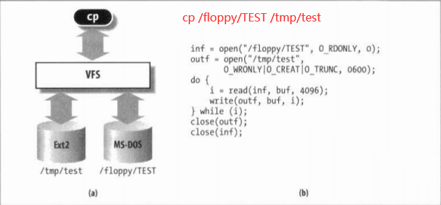

> 本篇笔记是《深入理解Linux内核第三版》第十二章的读书笔记
>
> 本章主要讨论的是VFS的设计目标，结构及其实现。
>
> 讨论五个Unix标准文件类型中的三个文件类型：普通文件，目录文件和符号链接文件。
>
> 设备文件见13章。管道文件见19章。

# 大纲

- VFS是什么
- 虚拟文件系统的作用
- VFS支持的文件系统(三种主要类型)
- VFS的数据结构
- 文件系统的处理
- 路径名的查找
- VFS系统调用的实现
- 文件加锁

# VFS是什么

VFS: 虚拟文件系统（Virtual Filesystem），也可以称之为虚拟文件系统转换（Virtual Filesystem Switch）是一个内核软件层，用来处理与Unix标准文件系统相关的所有系统调用。其健壮性表现在能为各种文件系统提供一个通用的接口(中间层的思想)。

VFS是用户的应用程序与文件系统实现之间的抽象层。

我们来看一个例子 cp /floppy/TEST /tmp/test

